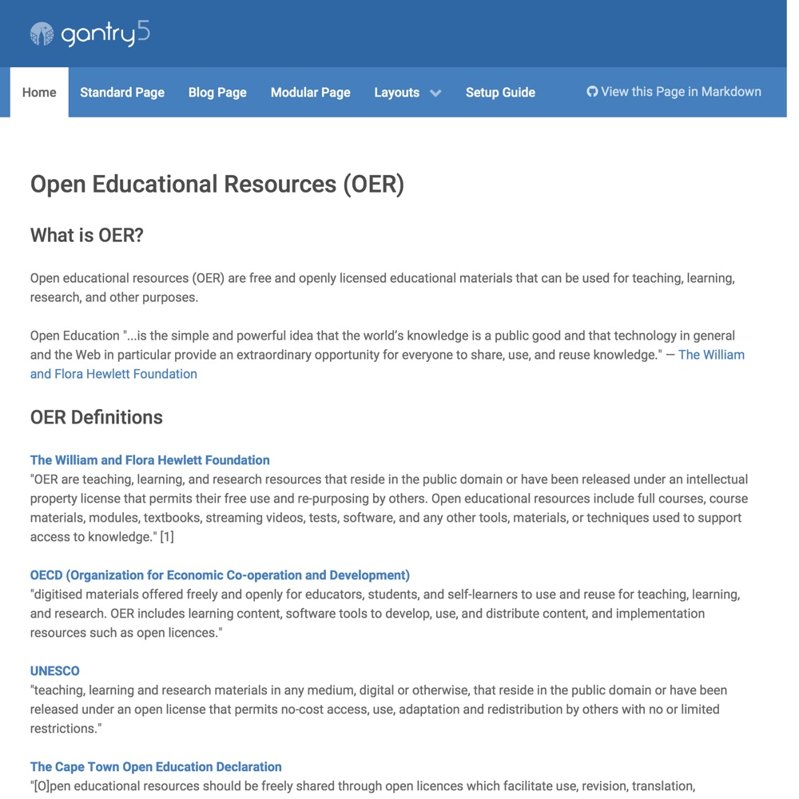

# OER Content Space Skeleton

[](http://demo.hibbittsdesign.org/grav-oer-content-space/)
[](https://github.com/hibbitts-design/grav-skeleton-gantry-oer-content/blob/master/LICENSE)

[](https://gitter.im/hibbitts-design/grav-open-edu)

The *OER Content Space* skeleton package is designed to share and collaboratively update [Markdown-based](http://commonmark.org/help/) Open Educational Resources content using seamless GitHub/GitLab syncing. This package includes the [Gantry](http://gantry.org/) framework and and two Gantry themes (*Hydrogen* and *Helium*) as well as the Gantry particles [Edit/View Page in Git](https://github.com/hibbitts-design/grav-gantry5-particle-edit-view-page-in-git) and [Creative Commons License](https://github.com/hibbitts-design/grav-gantry5-particle-cc-license) pre-installed.



# Why use the Grav OER Content Space Project?
* To quickly leverage a modern flat-file CMS (i.e. Grav) for the creation and presentation of OER content
* To make OER content future-ready by keeping it always directly accessible (vs. within a specific platform)
* To provide direct access to OER content for site visitors (in Markdown or HTML format) to facilitate easier reuse
* To support collaboration and version control of OER content with the Git service (e.g. GitHub) of your choice
* To quickly and easily update OER content online or locally using the tools of your choice
* To provide a mobile and multi-device friendly visual presentation of your OER content
* To easily customize the presentation of your OER content using a visual theme builder (i.e. Gantry 5)

# OER Content Space Highlights
* [Edit Page in Git Particle](https://github.com/hibbitts-design/grav-gantry5-particle-edit-view-page-in-git) for Gantry pre-installed
* [Git Sync Plugin](https://github.com/trilbymedia/grav-plugin-git-sync) for Grav pre-installed
* [Creative Commons (CC) License Particle](https://github.com/hibbitts-design/grav-gantry5-particle-cc-license) for Gantry pre-installed
* [Hypothesis Particle](https://github.com/hibbitts-design/grav-gantry5-particle-hypothesis) for Gantry pre-installed
* Markdown (and optionally HTML) page content
* Full-width, left and right sidebar page layouts
* Sidebar is a standard Grav page, which can also contain HTML
* [Gantry 5](http://gantry.org/) visual theme builder included
* Two responsive Gantry 5 themes (Hydrogen and Helium) pre-configured

# Installing the OER Content Space Site
## Web Install
**Pre-flight Checklist**  
1. Confirm Webserver PHP version (PHP 5.5.9 or higher)  
2. Webserver login credentials (username and password)  
3. Git version 1.7.1 or higher installed on your Webserver

**Installation Steps**  
1. Download the ready-to-run [OER Content Space Skeleton Package](http://hibbittsdesign.org/blog/downloads/grav-skeleton-oer-content-space-site.zip)  
2. Unzip the package onto your desktop  
3. Copy the _entire_ OER Content Space site folder to your Webserver  
4. Point your browser to the Webserver folder  
5. Create your site administrator account when prompted  
6. And you're done! (press the  icon in the Admin Panel to preview site)  

## Git Sync Configuration
On the far-right of your site menubar there will be a reminder displayed to complete the two steps to enable GitHub/GitLab syncing and editing of your site content. First tap on the ```Setup Git Sync Plugin (Step 1 of 2)``` menubar link, complete the displayed setup wizard, then return to viewing your site and tap the ```Setup Edit Page in Git Link (Step of 2)``` menubar link and provide the base URL to your created Git repository.

# Configuration Option

## Edit/View Page in Git Particle Options


## Creative Commons License Particle Options


## Gantry 5 Layout Manager

_Image courtesy of [gantry.org](http://gantry.org/)_

## OER Content Space Skeleton Demo
[](http://www.youtube.com/watch?v=Tt9KvCLqp84 "Grav CMS Gantry 5 OER Content Skeleton Sharing/Editing Demo ")  

## Page Header Options
The included 'Edit/View Page in Git' particle supports the following page header options:
```
hide_git_repo_link: true    # hide Git Repository edit link for this page, up to but not including the '/pages/...' For example, 'https://github.com/paulhibbitts/grav-skeleton-gantry-oer-content/tree/master'.  
git_repo_link_url: https://github.com/hibbitts-design/grav-skeleton-course-hub/tree/master/pages/01.home   # to override the automatically calculated Git Repository URL
git_repo_link_text: View in Markdown   # to override the default URL text label
```

## Site Config Options
The included 'Edit/View Page in Git' particle supports the following site config option:

```
hide_git_repo_link_pages:    # list of pages to hide Git Repository edit link on
    - login
    - logout                        
```
